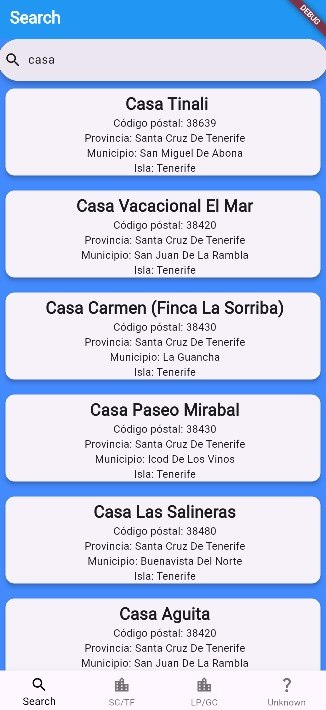
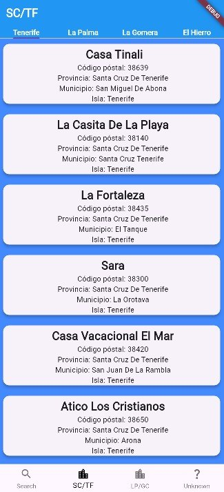
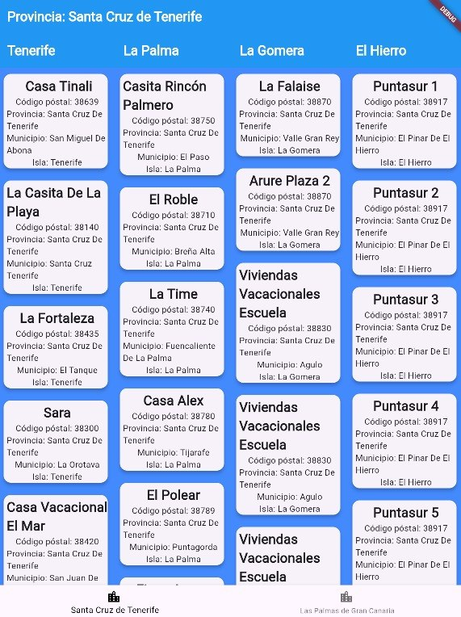
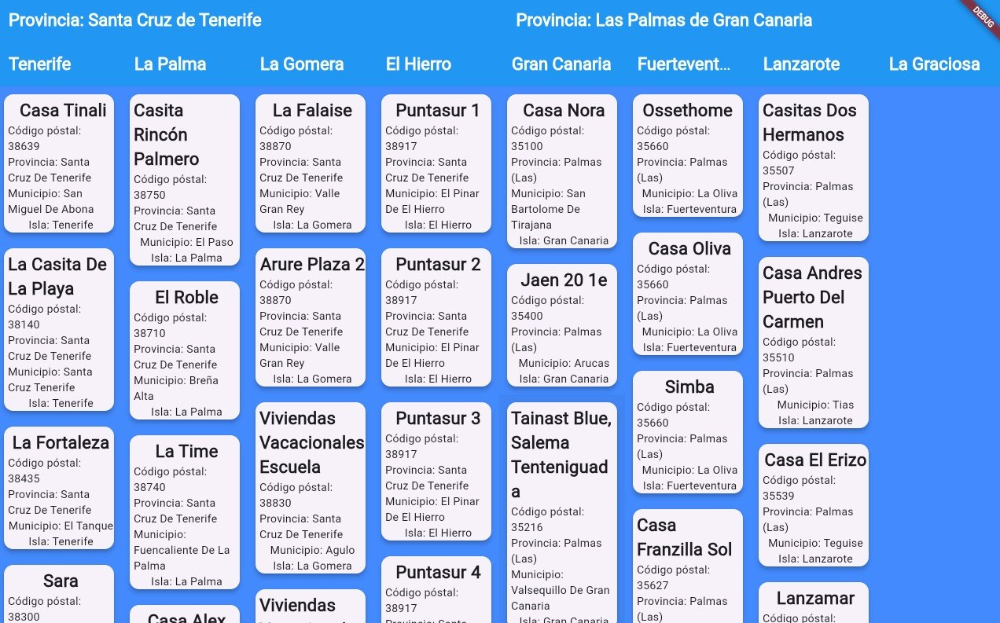

# Advanced Flutter Development – Canary Islands Holiday Rentals Open Data Demo (2026)

  
  
  

  

This repository contains the complete source code of the application developed during the **Advanced Flutter course (2026)**.

The project demonstrates how to build a **responsive and adaptive Flutter application** using real Open Data from the Canary Islands Government. The application consumes public data about registered holiday rental establishments across the Canary Islands and dynamically adapts its interface to different screen sizes.

It is designed as a **practical educational project** that brings together advanced Flutter widgets, responsive layouts, navigation, search functionality, Open Data consumption and software architecture in a complete functional application.

⚠️ **Note:** This repository contains the application developed during the course. Some topics covered in the complete course syllabus, such as Riverpod, SQLite persistence and Generative AI, are taught separately and are not implemented in this particular demo application.

---

## 🎯 Purpose

To provide students, educators and self-learners with a functional Flutter project that demonstrates how to:

- Build responsive and adaptive user interfaces with Flutter.
- Develop interfaces for mobile, tablet, web and desktop-sized layouts.
- Consume and process real public Open Data.
- Parse JSON data into application models.
- Organise information using multiple navigation patterns.
- Implement search functionality over real datasets.
- Use advanced Flutter widgets in a complete application.
- Structure a Flutter project following Clean Architecture and separation-of-concerns principles.
- Build maintainable applications whose UI can evolve according to the available screen space.

---

## 📱 Application Features

The application provides access to public information about registered holiday rental establishments in the Canary Islands.

Its main features include:

- 🔎 Search functionality for holiday rental establishments.
- 🏝️ Organisation of establishments by province and island.
- 📱 Mobile-specific navigation using `BottomNavigationBar`.
- 📑 Island navigation using `TabBar` and `TabBarView`.
- 🔍 Search interface using `SearchBar`.
- 🖥️ Responsive layouts for different screen widths.
- 🔄 Adaptive presentation depending on the available screen space.
- 📋 Dynamic rendering of Open Data records.
- 🎨 Reusable visual components using widgets such as `Card`.
- 🌐 Consumption of real public Open Data.

---

## 🧠 Topics Covered in the Course

The complete Advanced Flutter course covers:

- ✅ Advanced Flutter fundamentals and widgets.
- ✅ State management with Riverpod.
- ✅ Responsive and multiplatform design.
- ✅ Local persistence with SQLite.
- ✅ Clean Architecture.
- ✅ Development of a functional MVP.
- ✅ Generative AI applied to Flutter development.

### Concepts implemented in this project

This particular application demonstrates:

- ✅ Advanced Flutter widgets.
- ✅ Responsive and adaptive UI design.
- ✅ Multiplatform-oriented layouts.
- ✅ Clean Architecture principles.
- ✅ Separation of concerns.
- ✅ Functional MVP development.
- ✅ HTTP/Open Data consumption.
- ✅ JSON processing and model mapping.
- ✅ Search functionality.
- ✅ `BottomNavigationBar`.
- ✅ `TabBar` and `TabBarView`.
- ✅ `SearchBar`.
- ✅ Dynamic lists and cards.
- ✅ Layout adaptation according to screen size.

### Course topics not implemented in this demo

The following concepts are covered during the course but intentionally remain outside the scope of this application:

- Riverpod state management.
- SQLite local persistence.
- Generative AI.

This separation keeps the demo focused while allowing these technologies to be studied independently during their corresponding course modules.

---

## 📐 Responsive and Adaptive Design

One of the main objectives of this project is to demonstrate that a Flutter application does not need to use the same interface on every device.

The application adapts its presentation according to the available screen width.

On smaller screens, the interface prioritises vertical navigation and individual island views. On wider screens, the available space is used to display information from several islands simultaneously.

This approach allows the same Flutter codebase to provide appropriate user experiences across:

- 📱 Smartphones.
- 📱 Tablets.
- 🌐 Web browsers.
- 🖥️ Desktop-sized displays.

The screenshots above show examples of the application running at different browser viewport sizes.

---

## 🏗️ Architecture

The project follows a layered architecture based on separation of concerns and Clean Architecture principles.

The main responsibilities are separated into layers so that the user interface does not directly handle data-access logic.

Typical responsibilities include:

- **UI Layer** – Screens, widgets and user interaction.
- **Presentation Layer** – Coordinates the information required by the UI.
- **Repository Layer** – Provides an abstraction between the application and its data sources.
- **Data Layer** – Handles access to external data and JSON processing.
- **Model Layer** – Represents the data used throughout the application.

This structure makes the project easier to understand, maintain, test and extend.

---

## 🌐 Open Data Source

This application uses public data from the **Canary Islands Open Data Portal** concerning holiday rental establishments registered in the official tourism registry.

**Dataset:**

Holiday rental establishments registered in the Canary Islands tourism registry.

**Official Open Data Portal:**

https://datos.canarias.es/catalogos/general/dataset/establecimientos-extrahoteleros-de-tipologia-vivienda-vacacional-inscritos-en-el-registro/resource/2507a1c1-acf6-4c6a-a3cc-1d414849d1c5

The use of real Open Data allows students to work with an authentic dataset rather than static or artificially generated examples.

---

## 🚀 Possible Improvements

Some possible extensions for continuing the project after the course include:

- Integrate Riverpod for scalable state management.
- Add SQLite persistence for locally stored data.
- Add favourite establishments.
- Store recent searches.
- Implement additional filters by municipality, island or postal code.
- Add sorting options.
- Improve error and loading states.
- Add offline data caching.
- Add detailed establishment screens.
- Integrate map visualisation.
- Add accessibility improvements.
- Add automated unit and widget tests.
- Further refine desktop and large-screen layouts.
- Introduce Generative AI features where they provide meaningful functionality.

---

## 👨‍🏫 Instructor

Developed and taught by **Manuel Bacallado**.

Created as the practical application for the **Advanced Flutter course (2026)**.

The project is intended as an educational resource demonstrating how Flutter concepts can be combined to build a functional, maintainable and responsive application using real public data.

---

## 🔍 Keywords

Flutter · Dart · Advanced Flutter · Responsive Design · Adaptive UI · Multiplatform Development · Clean Architecture · Open Data · Canary Islands · Tenerife · Mobile Development · Educational Project
